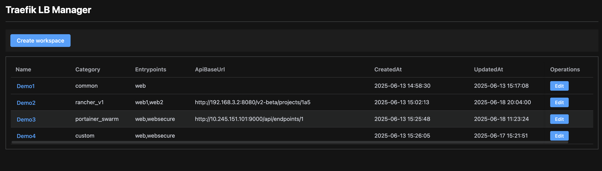
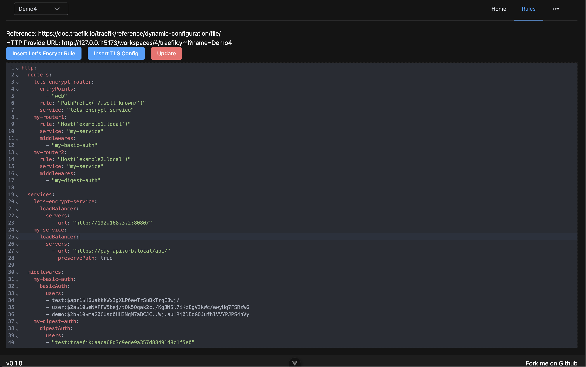
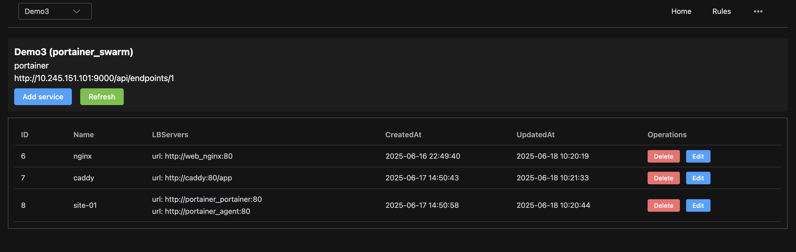
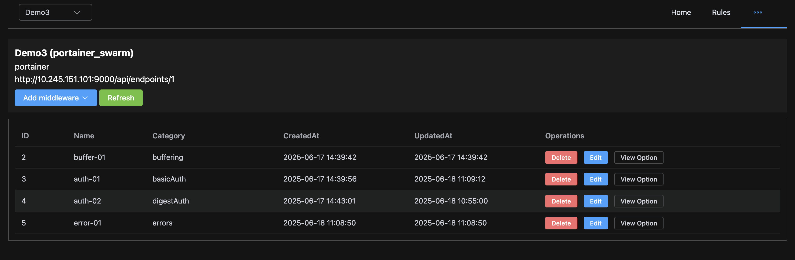
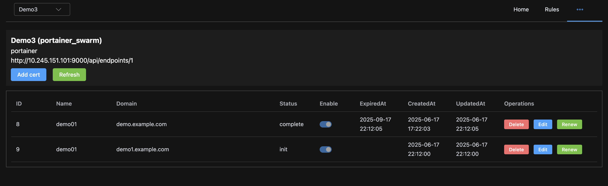
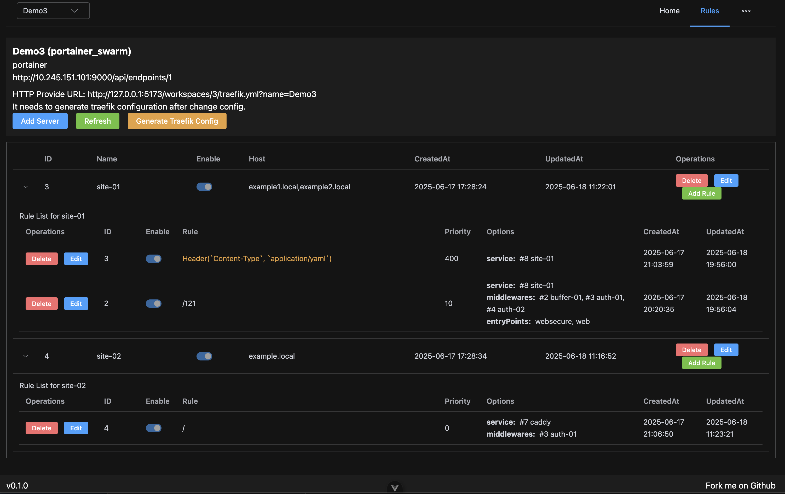

# Traefik LB Manager

It inspired by NginxProxyManager Project. It is a lightweight web-based tool for managing Traefik Load Balancer.

## Screenshots

It can create multiple workspace to manage different Traefik instances.



If workspace's category is "custom", it will edit the Traefik yaml configuration directly.


After create workspace, you can create some services.


You can create some middlewares if you need.


It can auto generate SSL certificate for your domain from Let's Encrypt.


Finnally, you can create some rules for your services. Then click "Generate Traefik Config" button to generate Traefik yaml configuration.
Then access the config from "HTTP Provide URL".


## Install

1. Setup LB Manager

```bash
docker run -d
  --name traefik-lb-manager
  --restart=always
  -p 8080:80
  -v <local folder>:/data
  -e APP_BASIC_AUTH_USER=<admin-user>
  -e APP_BASIC_AUTH_PASSWORD=<admin-password>
  -e APP_SSL_EMAIL=<your email>
  wusuopu/traefik-lb-manager:manager-latest
```

by default, it will use sqlite to store data, you can change it to mysql by change the `DATABASE_TYPE` and `DATABASE_DSN` environment variable. For example:
```bash
DATABASE_TYPE=mysql
DATABASE_DSN=<user>:<password>@tcp(<host>:<port>)/<database>?parseTime=true&multiStatements=true&charset=utf8mb4&loc=UTC
```

After create container, it needs to create database tables by run command in container.
```bash
docker exec -it traefik-lb-manager sh
./goose db:create
./goose up
```

2. Setup Traefik

```bash
docker run -d
  --name traefik
  --restart=always
  -p 80:80
  -p 443:443
  -e "LB_MANAGER_BASE_ENDPOINT=http://192.168.3.2:8080/workspaces/3"
  -e "LB_MANAGER_QUERY_PARAMS=name=Demo3"
  wusuopu/traefik-lb-manager:traefik-v3.4.0
```